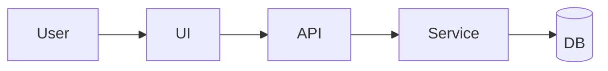
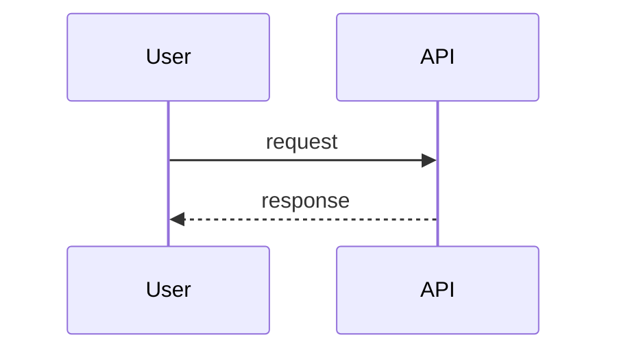

# Technical Design — <Feature>

| Field | Value |
|---|---|
| Requirements | docs/02-requirements/requirements.md (vX) |
| Tech Lead | |
| Status | Draft / In review / Approved |

## 1. Overview
<What changes, in 3–5 sentences.>

## 2. Current state
<Relevant modules, data, integrations as they exist today — with file paths.>

## 3. Proposed design
### 3.1 Components

### 3.2 Data model
| Entity / table | Change | Migration notes |
|---|---|---|

### 3.3 Interfaces / APIs
| Method & path | Request | Response | Errors |
|---|---|---|---|

### 3.4 Main flow

## 4. Edge cases & failure modes
| Case | Handling | AC |
|---|---|---|

## 5. Security, privacy & threat model
### 5.1 Threat model (STRIDE)
| Asset / flow | Threat (S/T/R/I/D/E) | Scenario | Mitigation | AC / NFR |
|---|---|---|---|---|
| | Spoofing | | | |
| | Tampering | | | |
| | Repudiation | | | |
| | Information disclosure | | | |
| | Denial of service | | | |
| | Elevation of privilege | | | |

### 5.2 Privacy & audit
- PII touched / retention:
- Audit events:
- LLM / agent use (if any): prompt-injection and data-exposure controls:

## 6. Observability
- SLOs implemented (from requirements) and their SLIs:
- Traces (OpenTelemetry spans for the new flows):
- Logs (structured, no PII):
- Metrics:
- Alerts (on SLO burn rate, not raw errors):

## 7. Rollout & rollback
- Feature flag:
- Migration order:
- Rollback:

## 8. Requirement coverage
| AC / NFR | Component(s) | Notes |
|---|---|---|

## 9. Decisions (ADRs)
- ADR-001 — <title> — Proposed

## 10. Risks & open questions
- [ ]
